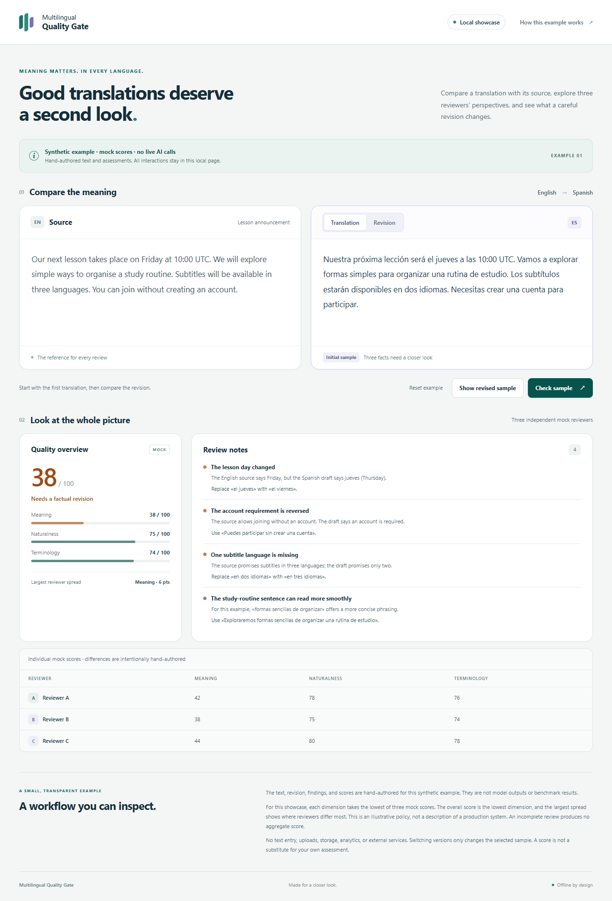
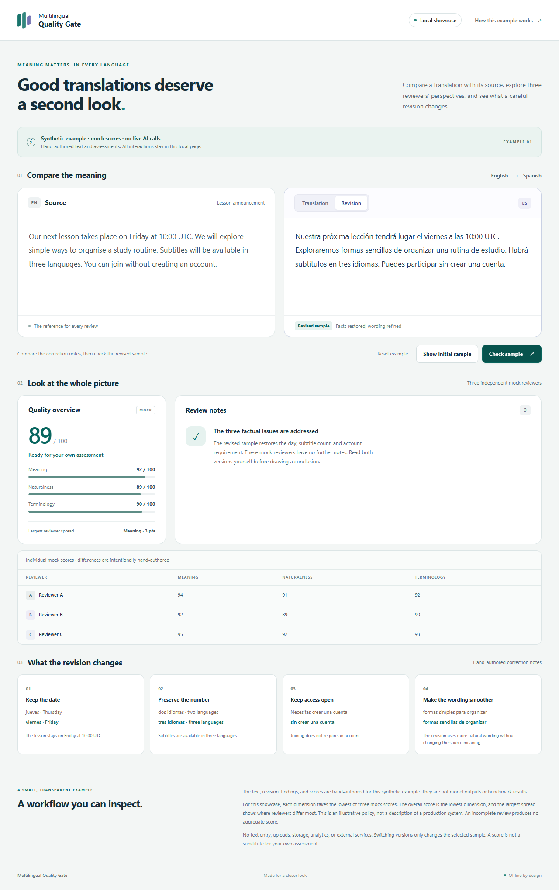

# Multilingual Quality Gate

A cross-language reliability layer for AI-generated multilingual content.

Multilingual content can read fluently while changing a deadline, requirement, or instruction. Before publication, the meaning and tone must survive, too.

Multilingual Quality Gate grew out of a real production problem. Its founder, Olga, was using an AI-assisted workflow to localize video content into approximately ten languages. Native-speaker feedback revealed that some published translations sounded unnatural — an issue that was difficult to detect in languages she did not speak.

## Why this matters

Organisations increasingly use AI in languages their teams cannot personally verify. A fluent output can still change a requirement, deadline, restriction or business decision. Multilingual Quality Gate explores how independent evaluation can make these failures visible before they reach users.

## Try the working product

[Open the live product](https://multigate.downlds.app/).

Explore how a translation compares with its source, where reviewers identify different concerns, and how revisions can be assessed again. Live AI checks may require sign-in.

The live product is a working application. This public repository is intentionally limited to a sanitized offline showcase so that production integrations, credentials, prompts and private calibration remain private. The showcase makes no real model calls and contains no customer content or benchmark results.

## Current status

- Working web application deployed
- Independent multi-model evaluation implemented in the private working version
- Meaning and naturalness assessed separately
- Revision and reassessment workflow implemented
- Exploring extension to multilingual AI-agent reliability and governance

## Explore the local showcase

This public showcase was prepared for conversations with Halif Hatch about the product and its direction. It does not imply an official affiliation or endorsement.

The example is a fictional four-sentence lesson announcement translated from English into Spanish. Its initial translation contains three concrete changes in meaning: Friday becomes Thursday, three subtitle languages become two, and account-free access becomes an account requirement.

Three generic reviewers provide prewritten findings and ratings. Their differences illustrate why an aggregate score needs supporting evidence. These synthetic fixtures do not measure model performance or translation accuracy.

To run the showcase, use Node.js 22 or newer:

```sh
npm start
```

Open the local address printed by the server. No dependency installation or environment file is needed. To verify the demo logic:

```sh
npm test
```

Try this short walkthrough:

1. Read the source and the **Translation** sample, then select **Check sample**.
2. Inspect the findings for meaning preservation, naturalness, terminology, and reviewer disagreement.
3. Select **Show revised sample**, then **Check sample** again to view the revised fixture assessment.
4. Compare the **Translation** and **Revision** tabs; use **Reset example** to repeat the walkthrough.

The demo uses fixed text, fixed assessments, and an educational evaluation policy. It does not accept private text or require credentials.



*Local synthetic showcase: the deliberately flawed sample and its hand-authored assessment. This is not a customer run.*



*Local synthetic showcase: the revised sample and its hand-authored reassessment. This is not a customer run.*

## Design and direction

The product design is source plus candidate → independent review → structured findings → revision → fresh assessment, with the best candidate and assessment history preserved. This showcase illustrates only two fixed samples and their most recent mock assessments in memory. Automatic best-candidate selection and persistent history are not implemented here.

A future direction is reliability and governance for multilingual AI agents: making meaning changes and disagreements visible before an agent’s output is used. This is a direction for exploration, not a claim that agent-governance features have shipped.

See the [public architecture](docs/architecture.md), [synthetic demo guide](docs/demo-example.md), and [safety and scope](docs/safety-and-scope.md) for the boundaries and walkthrough.
