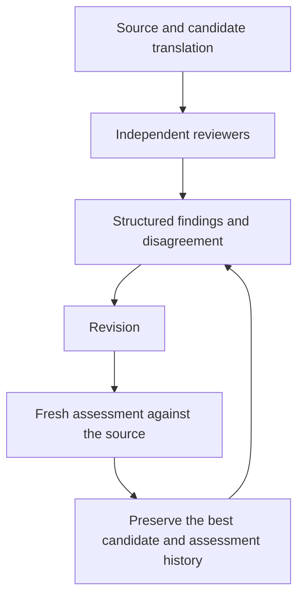

# Public architecture

Multilingual Quality Gate addresses a simple review problem: a fluent translation may still alter what the source says. The public design uses independent multi-model evaluation to make meaning, naturalness, tone, and reviewer disagreement visible before publication.

This document describes the workflow at a high level. The repository implements only a local demonstration with hand-authored synthetic fixtures; it does not contain the production implementation or make real model calls.

## Review loop

The source stays the reference throughout the loop. Reviewers assess the candidate independently, so their conclusions can be compared without treating agreement as proof of correctness.

Structured findings identify the affected content, explain the meaning or expression concern, and support a targeted revision. Disagreement remains visible because a single overall rating can hide a material issue.

A revised candidate receives a fresh assessment against the source. Revision alone is not evidence of improvement. The workflow preserves the best candidate and the assessment history so that later changes can be judged in context.

## Local demonstration boundary

The browser interface in `demo/index.html`, `demo/styles.css`, and `demo/app.mjs` presents a fixed English-to-Spanish example. `demo/fixture.mjs` supplies the fictional source, flawed translation, and revised translation. `demo/mock-evaluators.mjs` supplies three generic reviewers’ prewritten responses. `demo/evaluation.mjs` applies the transparent educational policy to those responses.

Any conservative minimum or disagreement spread shown by this demo is an illustrative policy, not a disclosure of private production calibration. Switching samples and checking them again selects another fixture assessment; it does not invoke an AI model or establish accuracy.

The showcase contains no production prompts, model weights, backend infrastructure details, account identifiers, or private configuration. It needs no credentials or environment file.

## Future direction

The same review questions could inform reliability and governance for multilingual AI agents: did meaning survive, did reviewers disagree, and did a proposed correction improve the candidate? This is a future direction, not a description of shipped agent-governance features.
